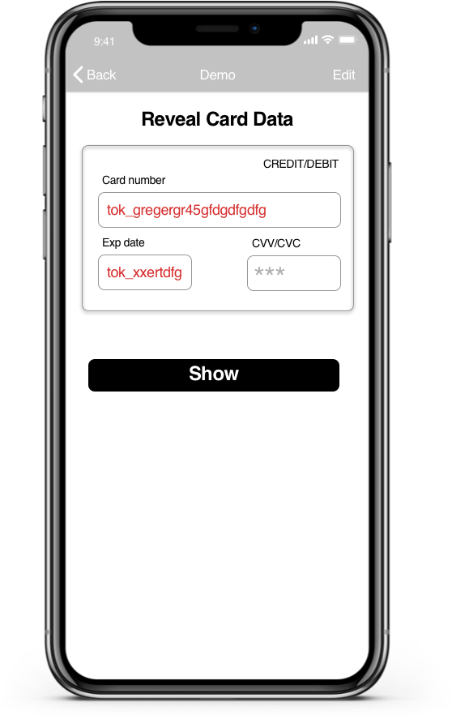
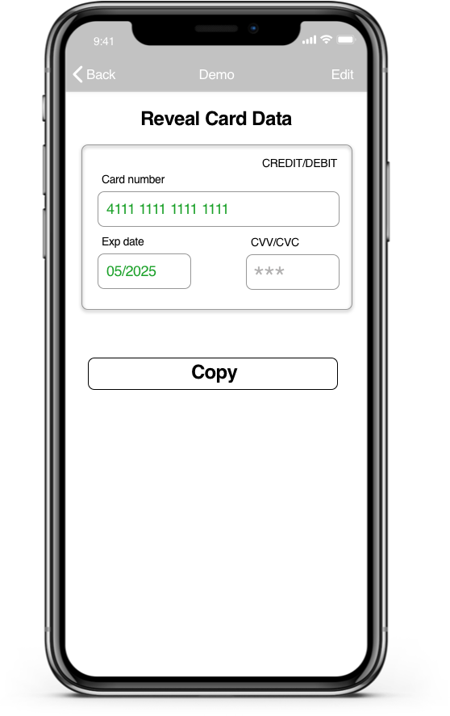

[]()
[](./LICENSE)
[]()
[](./AGENTS.md)


# VGS Show iOS SDK

VGS Show is a product that lets you securely reveal previously tokenized/aliased data (text, images, PDFs) from Very Good Security (VGS) without that raw data ever passing through or being stored in your systems. `VGSShowSDK` decodes reveal responses and renders values directly into managed UI elements (`VGSLabel`, `VGSImageView`, `VGSPDFView`) while enforcing strict logging and masking rules.

<p align="center">
  
  
</p>

Table of contents
=================
<!--ts-->
   * [Before you start](#before-you-start)
   * [Integration](#integration)
      * [CocoaPods](#cocoapods)
      * [Swift Package Manager](#swift-package-manager-xcode-12)
   * [AI Agent Integration](#ai-agent-integration)
   * [Usage](#usage)
      * [Import SDK](#import-sdk)
      * [Create VGSShow instance and UI Elements](#create-vgsshow-instance-and-ui-elements)
      * [Reveal Request](#reveal-request)
      * [Security & Logging](#security--logging)
      * [UI Components Overview](#ui-components-overview)
      * [Testing Basics](#testing-basics)
      * [Demo Application](#demo-application)
      * [Releases](#releases)
      * [Metrics](#metrics)
   * [Dependencies](#dependencies)
   * [License](#license)
<!--te-->

## Before you start
1. Register or log in to your <a href="https://dashboard.verygoodsecurity.com/dashboard/" target="_blank">VGS Dashboard</a>.
2. A sandbox vault is pre-created; use its Vault ID in initialization.
3. Ensure you already have aliases (e.g. created via VGS Collect) to reveal. To create aliases you can use [VGSCollectSDK](https://github.com/verygoodsecurity/vgs-collect-ios) or follow the inbound connection guide in our [docs](https://www.verygoodsecurity.com/docs/guides/inbound-connection#try-it-out).

## Integration

### CocoaPods

Add to your `Podfile` (pin exact version for reproducibility):
```ruby
pod 'VGSShowSDK', '1.3.0'
```
Then run:
```bash
pod install
```

### Swift Package Manager, Xcode 12+
From Xcode: File > Add Packages… and enter:
```
https://github.com/verygoodsecurity/vgs-show-ios
```
Select version rule "Exact" and specify `1.3.0`.

Or in `Package.swift` (exact version pin):
```swift
// ...existing code...
dependencies: [
  .package(url: "https://github.com/verygoodsecurity/vgs-show-ios", exact: "1.3.0")
]
// ...existing code...
```

## AI Agent Integration
Use [`AGENTS.md`](./AGENTS.md) as context for autonomous coding agents integrating or maintaining `VGSShowSDK`. It lists public APIs, security constraints, validation rules, upgrade & testing expectations.

Minimal System Prompt Example:
```
You are an autonomous engineering agent integrating the VGS Show iOS SDK into an existing Swift app.
Use the full contents of AGENTS.md as the authoritative policy.
Constraints:
- Only public, non-deprecated APIs.
- No raw sensitive data in logs/tests.
- All subscribed views must have non-empty contentPath values before requests.
- Secure masking applied before user-visible refresh when required.
Goals:
1. Add a screen revealing a user's details (card label, name label) using a single batched request.
2. Implement partial masking for the card.
3. Provide unit tests for missing path.
Return: Modified Swift source files only, no secrets.
```

Developer Prompt (Inline Example for a Single Task):
```
Task: Add secure display of account number with custom last-4 masking while preserving transformation regex formatting.
Follow AGENTS.md guidelines.
Do not log raw account number; add tests for masking and a negative near-miss path key.
```

## Usage

### Import SDK
```swift
import VGSShowSDK
```

### Create VGSShow instance and UI Elements
Use your `<VAULT_ID>` to initialize a `VGSShow` instance for the desired environment (e.g. `.sandbox`).

```swift
/// VGSShow instance configured for sandbox.
let vgsShow = VGSShow(id: "<VAULT_ID>", environment: .sandbox)

/// Labels for card data.
private let cardNumberLabel = VGSLabel()
private let expDateLabel = VGSLabel()

override func viewDidLoad() {
  super.viewDidLoad()

  // Set content paths (JSON keys expected in reveal response).
  cardNumberLabel.contentPath = "cardData.cardNumber"
  expDateLabel.contentPath = "cardData.expDate"

  // Subscribe views.
  vgsShow.subscribe(cardNumberLabel)
  vgsShow.subscribe(expDateLabel)

  // Configure appearance.
  configureUI()
}

private func configureUI() {
  let paddings = UIEdgeInsets(top: 8, left: 8, bottom: 8, right: 8)
  let font = UIFont.systemFont(ofSize: 20)
  let bg = UIColor.systemBlue

  [cardNumberLabel, expDateLabel].forEach { label in
    label.paddings = paddings
    label.font = font
    label.textColor = .white
    label.backgroundColor = bg
    label.layer.cornerRadius = 0
  }
  expDateLabel.characterSpacing = 0.83
}
```

### Reveal Request
Perform a reveal request; matching JSON fields populate subscribed views automatically.

```swift
func revealData() {
  // Custom non-sensitive headers.
  vgsShow.customHeaders = [
    "X-USER-ID": UUID().uuidString
  ]

  // Additional payload keys as required by your backend contract.
  let customPayload = [
    "reveal": ["cardData.cardNumber", "cardData.expDate"]
  ]

  vgsShow.request(path: "/reveal", method: .post, payload: customPayload) { result in
    switch result {
    case .success(let statusCode):
      // Views already updated.
      print("Reveal success status=\(statusCode)")
    case .failure(let statusCode, let error):
      // Map error to safe user message (do not expose internals).
      let message = userMessage(for: error)
      print("Reveal failed status=\(statusCode), userMessage=\(message)")
    }
  }
}

private func userMessage(for error: Error?) -> String {
  guard let e = error as? VGSShowError, let type = e.type else { return "Reveal failed" }
  switch type {
  case .fieldNotFound: return "Requested data unavailable"
  case .invalidImageData, .invalidPDFData: return "Cannot display document"
  case .invalidBase64Data: return "Corrupted data"
  default: return "Reveal failed"
  }
}
```

### UI Components Overview
- `VGSLabel`: Reveals text; supports secure masking (`isSecureText` + range methods), placeholder styling (`VGSPlaceholderLabelStyle`), transformation regex, clipboard copy (`copyTextToClipboard`).
- `VGSImageView`: Reveals base64 or raw image data; delegate reports success/failure; `clear()` removes current image.
- `VGSPDFView`: Reveals base64 PDF data; display customization (mode, direction, scaling); delegate error handling.

All components require a non-empty `contentPath` set before a request.

### Demo Application
A demo application showcasing reveal flows is available: <a href="https://github.com/verygoodsecurity/vgs-show-ios/tree/main/VGSShowDemoApp">VGSShowDemoApp</a>.

### Releases
Follow SDK updates on the [Releases page](https://github.com/verygoodsecurity/vgs-show-ios/releases).

### Metrics
`VGSShowSDK` collects anonymous usage metrics (feature usage, version) to improve the product. No sensitive data is collected.
Opt-out:
```swift
VGSAnalyticsClient.shared.shouldCollectAnalytics = false
```

## Dependencies
- iOS 13+
- Swift 5.9

## License
VGSShow iOS SDK is released under the MIT license. See [LICENSE](./LICENSE) for details.
