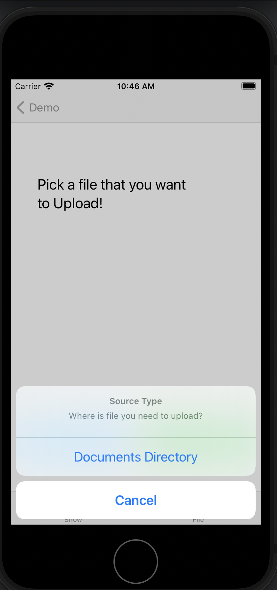
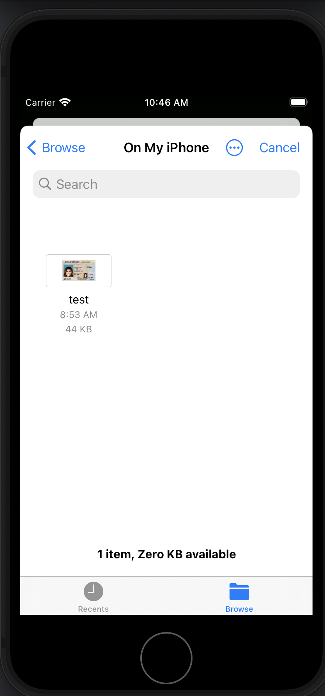
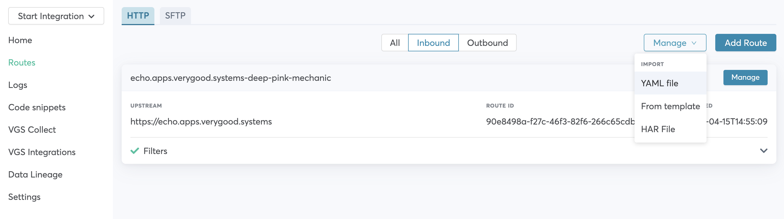

## Reveal PDF with VGSShow iOS SDK

With VGSShowSDK you can reveal and view pdf files. To redact pdf files you can use [VGSCollectSDK](https://github.com/verygoodsecurity/vgs-collect-ios) 

		    
		    
		    

> **_NOTE:_**  VGSPDFView in VGSShowSDK is available only from iOS 11 since it is build upon Apple PDFKit framework.

#### Step 1

Go to your <a href="https://dashboard.verygoodsecurity.com/" target="_blank">VGS organization</a> and establish <a href="https://www.verygoodsecurity.com/docs/getting-started/quick-integration#securing-inbound-connection" target="_blank">Inbound connection</a>. For this demo you can import pre-built route configuration:

-  Find the **pdf_configuration.yaml** file inside the app repository and download it.
-  Go to the **Routes** section on the <a href="https://dashboard.verygoodsecurity.com/" target="_blank">Dashboard</a> page and select the **Inbound** tab. 
-  Press **Manage** button at the right corner and select **Import YAML file**.
-  Choose **pdf_configuration.yaml** file that you just downloaded and tap on **Save** button to save the route.

#### Step 2

Run  `pod update` in `VGSShowDemoApp`.

#### Step 3

Setup `"<VAULT_ID>"`.

Find `DemoAppConfig.swift` in app and replace `vaultId` constant with your <a href="https://www.verygoodsecurity.com/docs/terminology/nomenclature#vault" target="_blank">vault id</a>.

#### Step 4

Drag and drop `test.pdf` file to [Files app](https://support.apple.com/en-us/HT206481) to your device. 
Testing on real device is recommended due to possible issues with iOS simulator and Files app.

#### Step 5

Run VGSShowDemoApp and select `Show Collected PDF` row. 
Switch to `File` tab, press on `Select File`, choose `Documents Directory` and select `test_pdf`.
Upload it, then switch to `Show` tab and press `Reveal` button.

